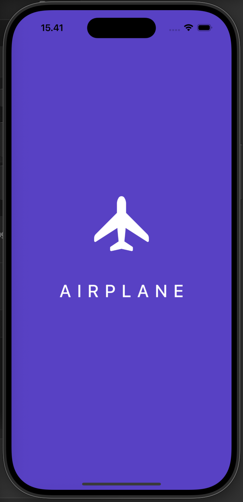
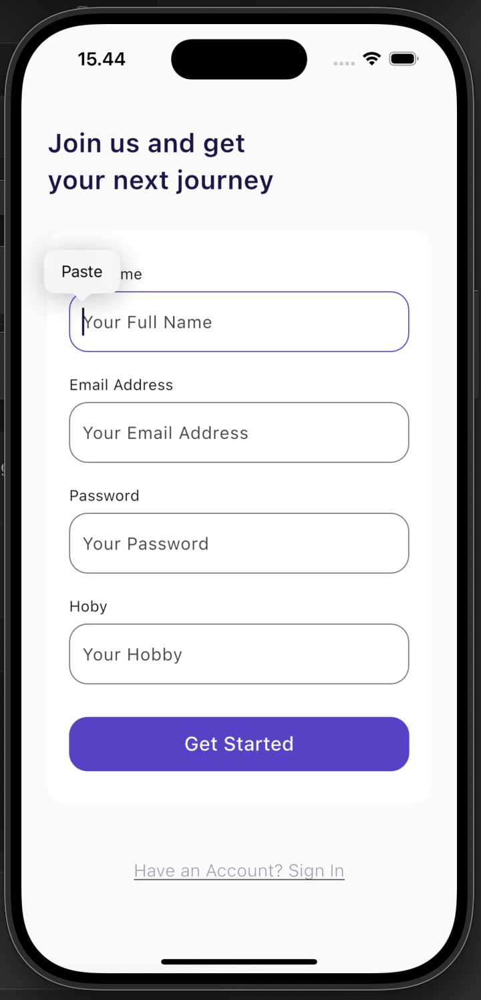
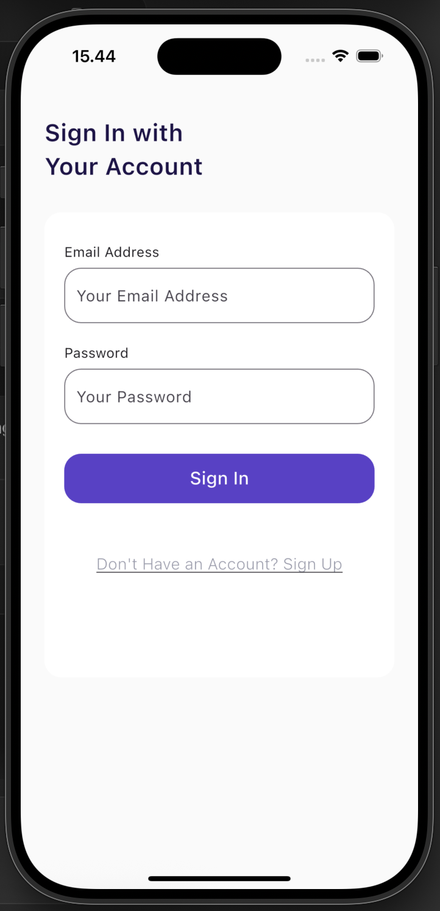
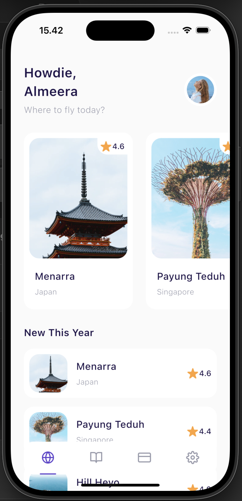
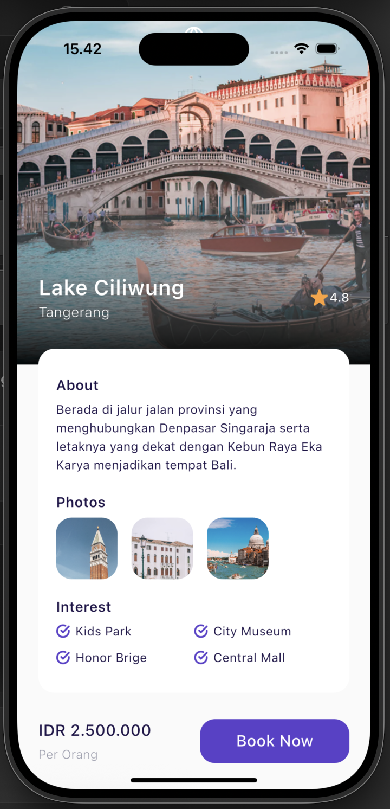
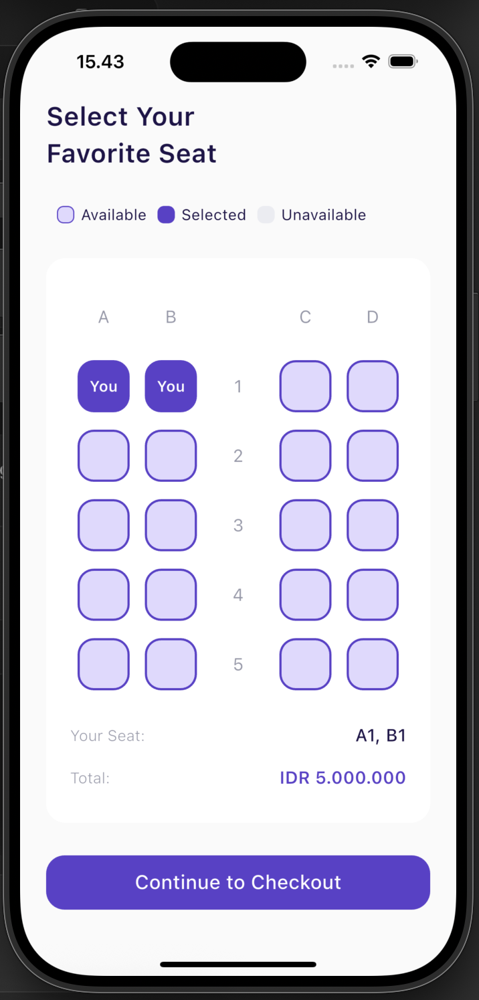
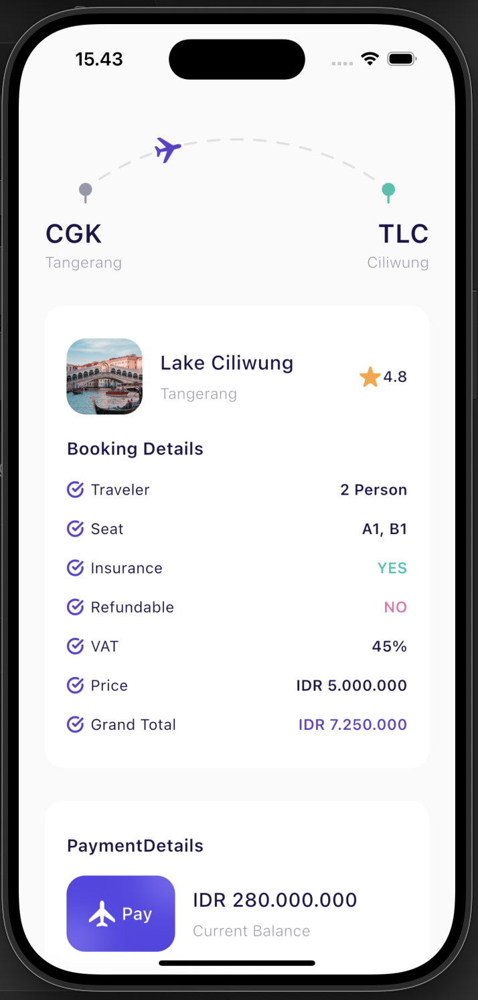
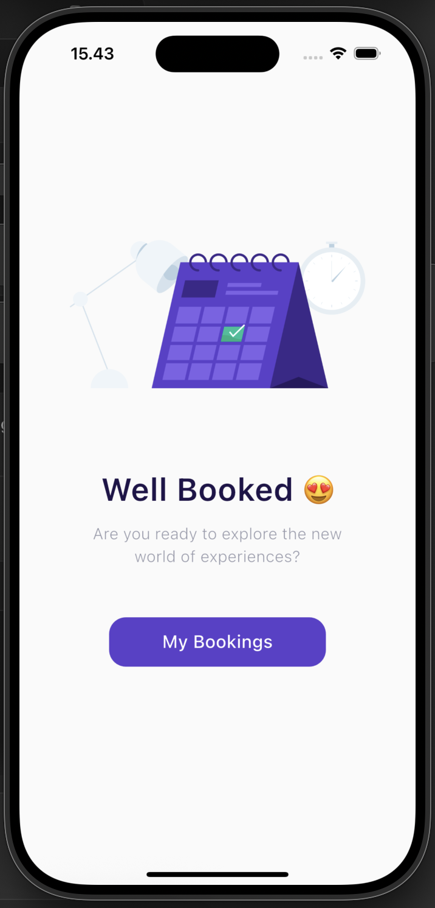
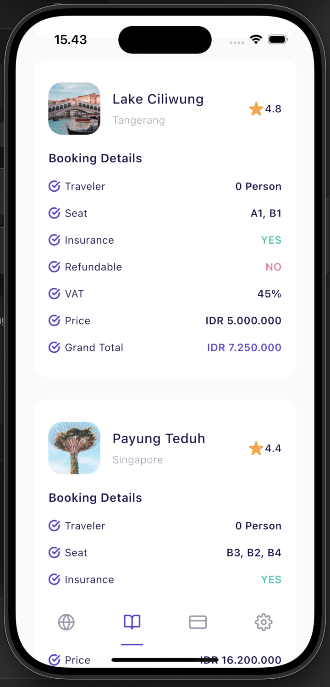
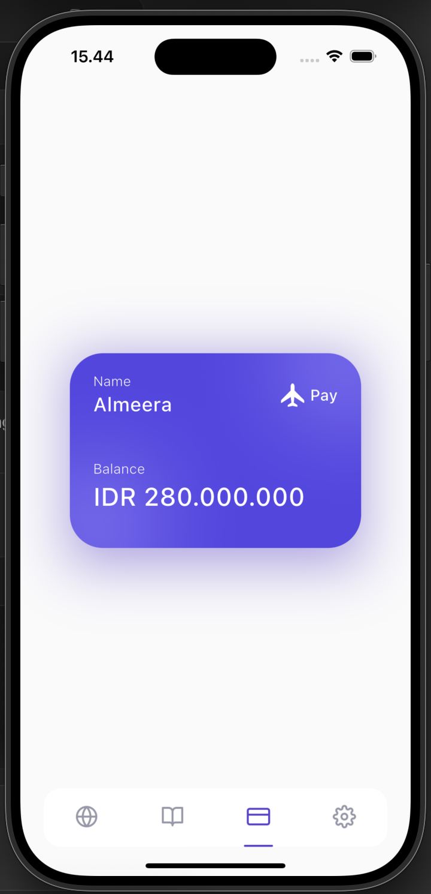

# Skybook - Airplane Ticket Booking Application

SkyBook is a modern and intuitive airplane ticket booking application designed to streamline the travel experience for users worldwide. Built using Flutter for cross-platform compatibility and Firebase for a robust backend infrastructure, SkyBook delivers fast, secure, and real-time booking capabilities across both Android and iOS platforms.

Key Features:
	•	Flight by destination
	•	Real-time availability and pricing updates
	•	Secure user authentication using Firebase Authentication
	•	Cloud Firestore integration for booking data and user preferences
	•	In-app seat selection and booking confirmation
	•	Booking history and e-ticket management

## Table of Contents

- [Getting Started](#getting-started)
  - [Prerequisites](#prerequisites)
  - [Installation](#installation)
  - [Setup](#setup)
- [Screenshots](#screenshots)
- [Built With](#built-with)
- [Author](#author)

## Getting Started

Before starting to install the project, there're some things that need to be done first.

### Prerequisites

Make sure all of these are properly installed in your system.

| Application  | Download                                                                            |
| ------------ | ----------------------------------------------------------------------------------- |
| Git          | [Windows](https://gitforwindows.org/) / [Linux](https://git-scm.com/download/linux) / [MacOS](https://git-scm.com/download/mac) |
| Flutter | [Link](https://docs.flutter.dev/install)                |

### Installation

First, clone this repository into your system.

```
git clone https://github.com/nurmuhamadrum/flutter-skybook-airplane-ticket.git
```

Then, install all the packages that described in `pubspec.yaml`.

```
flutter pub get
```

if you're using iOS then pod install on ios folder directory

```
pod install
```

### Setup

For the client setup, if you are using physical device to run the app, make sure your ADB drivers already installed or you can use Android Emulator from AVD (Android Virtual Device) Manager of Android Studio (_This part should be done while installing the React Native framework_) on this development I use iOS for development.

Then, install and run the application.

And for IOS :

`flutter run -d <device_id>`

And for Android :

`flutter run -d android`

then run the application and Wait till the application is installed and run into your device. Now, you can explore the Application and its features. Enjoy!

## Screenshots

<div style={{ display: 'flex' }}>

  
  
  
  
  
  
  
  
  
  

</div>


## Built With

- [FLUTTER](https://docs.flutter.dev/) - MOBILE FRONTEND
- [FIREBASE](https://firebase.google.com/) - FIREBASE

## Author

**Nur Muhamad Rum** - (https://nurmuhamadrum.vercel.app/)
